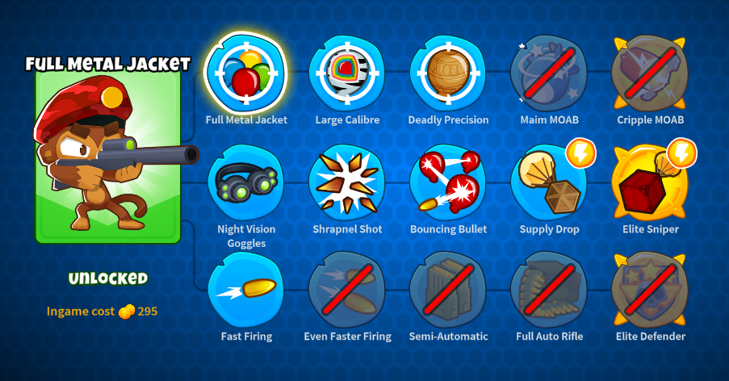
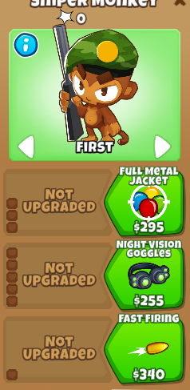

# Progressively-Harder

Make the game progressively harder by removing most used upgrades. **Only works on Impoppable (or in Challenge Editor with max round of 100 or more)**

# In Details
When the game starts (or when a victory is acquired), the game will take a random integer from 90 (by default) to 100. The mod will take a "picture" of all towers on the field at the given round. When the game will end as a victory, the mod will analyse the picture, detect which tower was the strongest (highest number of pops) and add a restriction on the highest tier of the tower. 

For example, if the best tower is a 025 Tack, it will put a restriction on the tack shooter of xx5. Restrictions can be reset and load (if you want to make a fun challenge for someone). If the best tower is a paragon (T6), a random T5 of the base tower will get restrict instead.

Note:

I chose to only make it work on Impoppable because at round 80-100, you have more T5's so restrictions are have less impact (For example, if the mod restricts a 1xx dart, it will lock 2xx, 3xx, 4xx and 5xx)
